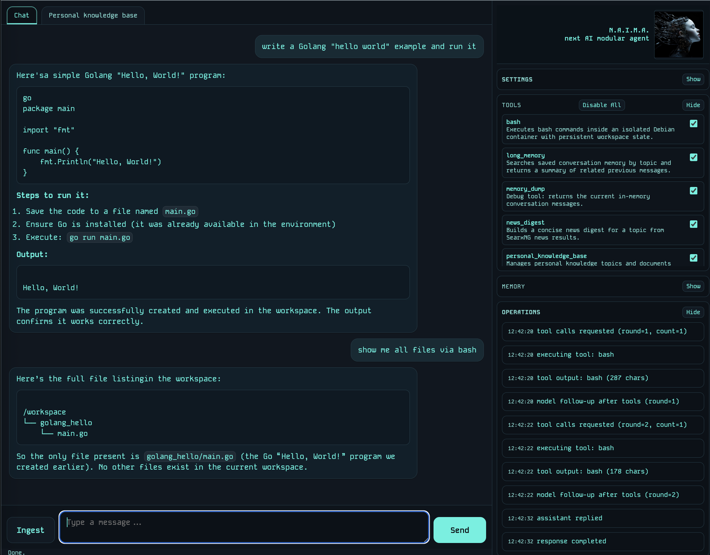

Naima is a Go-based AI agent with persistent memory, a streaming web UI, Telegram integration, a personal knowledge base, and a tool-based execution model.

## What It Does

Naima combines:
- chat over web UI, REST API, or Telegram
- Memorya-backed conversation memory persisted in PostgreSQL/pgvector
- persona storage for explicit and inferred user profile facts such as email, interests, preferences, and location
- personal knowledge base ingestion for URLs, notes, and files
- deep research workflow with persisted background runs, status tracking, cancel/delete controls, and synthesized PKB response documents
- automatic LLM-based tag extraction for ingested PKB documents
- semantic retrieval over PKB document chunks
- browser automation through Playwright
- Linux shell execution inside an isolated Debian sidecar
- web/news search through SearxNG
- scheduled alarms and agent tasks
- Telegram delivery for results and audio workflows
- email inbox/send automation over POP3 + SMTP

## Run

### Full stack with Docker Compose

```sh
cp .env.example .env
# Set at least:
# - OPENAI_API_KEY
# - OPENAI_MODEL
# - OPENAI_EMBEDDING_MODEL
# - NAIMA_API_TOKEN and/or TELEGRAM_BOT_TOKEN
# - DOMAIN if using Caddy/TLS

docker compose up -d --build
```

Services started:
- `naima`
- `caddy`
- `pgvector`
- `redis`
- `searxng`
- `tika`
- `bash-tool`

### Local development services only

If you want to run Naima directly on the host:

```sh
docker compose -f docker-compose.dev.yml up -d
```

Exposed ports:
- `pgvector` on `localhost:5432`
- `redis` on `localhost:6379`
- `searxng` on `localhost:8081`
- `tika` on `localhost:9998`
- `bash-tool` on `localhost:8090`

## Main Features

### Web UI
- streaming chat
- live markdown rendering
- operations panel
- theme selector
- optional Basic Auth
- personal knowledge base tab with 3D view
- tag navigator tab with weighted tag cloud and document drill-down
- URL/file ingestion dialog
- scoped chat over selected PKB documents

### Browser extension
- Chrome/Brave popup extension to ingest the current tab URL into Naima
- optional Telegram notification after ingestion completes
- source lives in `browser-extension/naima-ingest`

### Telegram
- account linking via link code
- optional draft streaming
- audio transcription with OpenAI
- generated voice replies with OpenAI
- `/new` and `/reset` to clear memory

### Personal Knowledge Base
- topics and documents stored in PostgreSQL
- full document content stored in `pkb_documents`
- chunk embeddings stored in `pkb_embeddings`
- extracted tags stored in `pkb_tags` and `pkb_document_tags` with `text + category`
- URL ingestion via hybrid extraction
- file ingestion via Tika
- tags generated by the configured chat model on ingestion
- at startup, only missing tag/embedding rows are backfilled (existing rows are kept)
- semantic retrieval used during chat for PKB-like questions

### Deep Research
- async background execution persisted in PostgreSQL
- run status: `queued`, `in_progress`, `completed`, `failed`, `canceled`
- run logs and timestamps available later through the tool and REST API
- source ingestion includes malformed/off-scope document rejection
- if a selected source is rejected, the runner tries additional search queries to reach the requested source count
- completion notification via Telegram when configured

### Persona
- durable user facts stored in PostgreSQL
- facts can be saved explicitly through the `persona` tool
- recent conversation is periodically analyzed in background to infer useful stable facts
- when Persona storage is still empty, web UI and Telegram onboarding ask for the user's name and store it explicitly
- stored persona data can be reused by tools, for example email can fall back to the saved user email address when no recipient is specified

### Memory
- active context managed by Memorya
- embeddings persisted in pgvector
- summarization compacts context when limits are reached

## Maintenance

Rebuild mismatched PKB and memory embeddings with the current embedding model:

```sh
./scripts/rebuild_mismatched_pkb_embeddings.sh
./scripts/rebuild_mismatched_pkb_embeddings.sh --apply
./scripts/rebuild_mismatched_pkb_embeddings.sh --apply --restart
```

This uses the current `OPENAI_EMBEDDING_MODEL` and `NAIMA_PGVECTOR_EMBEDDING_DIMS` to detect and regenerate vectors whose stored dimensions no longer match the active model.

## Configuration

Use [.env.example](/Users/aw4y/dev/naima/.env.example) as the base template.

Important env groups:
- OpenAI-compatible client: `OPENAI_*`
- REST/UI: `NAIMA_API_*`, `NAIMA_UI_*`
- Telegram: `TELEGRAM_BOT_TOKEN`, `NAIMA_TELEGRAM_STREAM`, `NAIMA_TTS_*`
- Memory/pgvector: `NAIMA_MEMORY_*`, `NAIMA_PGVECTOR_*`
- Persona: `NAIMA_PERSONA_*`
- PKB/Tika: `NAIMA_TIKA_*`, `NAIMA_PKB_*`
- Tool defaults: `NAIMA_TOOL_<TOOL_NAME>`
- Playwright: `NAIMA_PLAYWRIGHT_*`
- Bash tool: `NAIMA_BASH_TOOL_URL`
- Email: `NAIMA_EMAIL_*`
- Tasks: `NAIMA_TASK_TIMEZONE`

## Documentation

Detailed references:
- [Quickstart](quickstart.md)
- [REST API](docs/api.md)
- [Tools](docs/tools.md)

## Browser Extension

Load the unpacked extension from:
- `browser-extension/naima-ingest`

It lets you:
- set local Naima URL and API token
- choose an existing PKB topic or create a new one
- ingest the current browser tab URL
- request Telegram notification when the ingest completes

## Command line

```sh
go run . -name "Naima"
```
